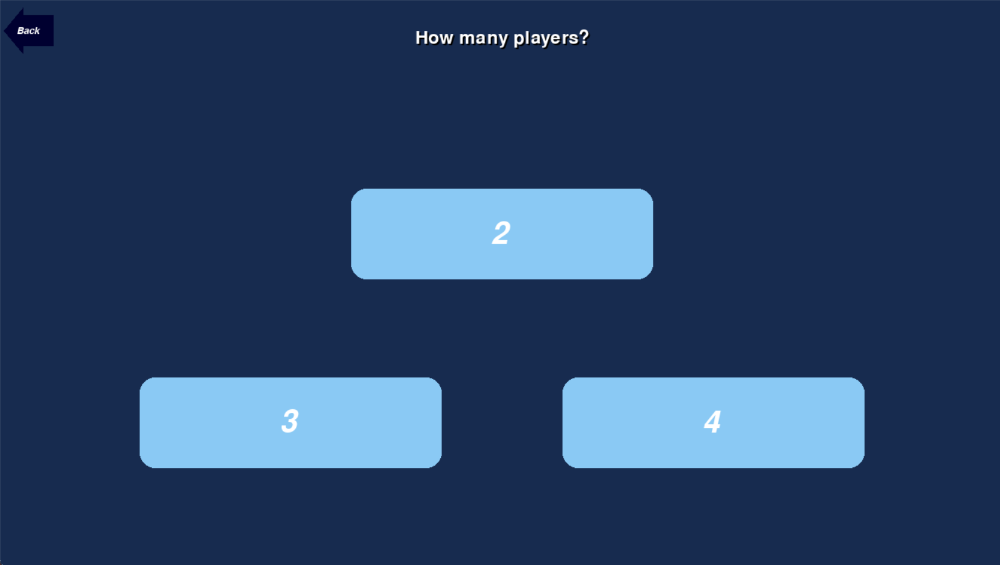

# Quoridor

## Documentation utilisateur

### Installation et exécution

Pour exécuter le jeu Quoridor, suivez les étapes ci-dessous

1. Assurez-vous d'avoir **Python 3.11** installé sur votre système.
1. Installez les dépendances requises en **exécutant la commande** suivante dans votre **terminal**
   > **pip install socket pickle threading random time**
1. executez également cette commande afin d'installer une version de pygame fonctionnelle
   > **pip install pygame --pre**
1. Naviguez vers le répertoire contenant le code source téléchargé.
1. Exécutez le jeu en utilisant cette commande
   > **python -m main**
1. Le jeu **Quoridor** devrait se lancer avec une interface graphique.
1. Si ce n'est pas le cas essayez de lancer le jeu en utilisant un IDE tel que **Visual Studio Code** ou **Pycharm**

### Utilisation des menus

#### Menu principal

Au lancement du jeu, vous êtes accueillie par le menu principal, il vous offre 3 options

- "Play" pour lancer une partie
- "Rules" pour lire les règles du jeu
- "Quit" pour quitter le jeu

#### Bouton Retour

Un bouton retour est présent dans le coin haut gauche de chaque menu. Il permet de revenir au menu précédent.

#### Régles

La page de régles contient tout ce qu'il y à a savoir sur le déroulement de la partie. vous pouvez naviguer dans en utilisant le défilement de la molette de la souris.

#### Jouer une partie en solo

Deux options se présentent a vous

- "Solo" permet de jouer sur un ordinateur
- "Multi" permet de jouer en multijoueur sans fil-local

choisisez donc le mode solo

Indiquez maintenant le nombre de joueurs que vous souhaitez avoir dans votre partie.

Faites de même avec le nombre de bots

Indiquez maintenant la taille de la grille de jeu

Finalement choisisez le nombre de barières que vous souhaitez avoir par joueurs

les fleches correspondent a des boutons permettant d'augmenter ou de diminuer le nombre de barières

une fois que vous serez satisfaits de votre choix, cliquez sur le bouton "Done" afin de lancer la partie

La partie démarre, vous pouvez maintenant jouer !

- Le premier joueur est tiré **aléatoirement**.
- Le joueur qui doit jouer est désigné par une pastille blanche sur le plateau, son encard a droite est également plus grand que les autres.
- Les cases roses sont les cases où vous pouvez vous déplacer.

Félicitation ! Vous avez désormais toute les connaissances nécessaires pour démarer la partie !

#### Créer une partie multijoueur sans fil-local

Après avoir appuyé sur "Play"
Choisissez le bouton "Multi"

On souhaite créer un serveur, il faut donc appuyer sur le bouton "Host"

On choisi le nombre de joueurs (Humains).
A savoir que si vous choisissez 3 joueurs la partie sera comblée avec un bot. le jeu ne pouvant pas être joué par un nombre impaire de joueurs

Indiquez maintenant la taille de la grille de jeu

Choisisez le nombre de barières que vous souhaitez avoir par joueurs

Finalement nommez votre serveur pour que les autres joueurs puissent s'y connecter.

Vous n'avez plus qu'a attendre que vos amis vous rejoignent dans la salle d'attente.
Quand tout le monde est prêt, cliquez sur le bouton "Start" pour lancer la partie.

Félicitation ! Vous n'avez plus qu'a jouer !

#### Rejoindre une partie multijoueur sans fil-local

Après avoir appuyer sur le bouton Play
Choisissez le bouton "Multi".

On souhaite rejoindre un serveur, il faut donc appuyer sur le bouton "Join"

Après quelques secondes, un nouveau menu apparait, il peut y avoir deux cas:

Aucun serveur n'est trouvé. Vous pouvez appuyer sur le bouton "Refresh" pour actualiser la liste des serveurs.

un serveur est trouvé, cliquez dessus pour le rejoindre.

Vous avez rejoint la salle d'attente, plus qu'a patienter que l'host lance la partie.

