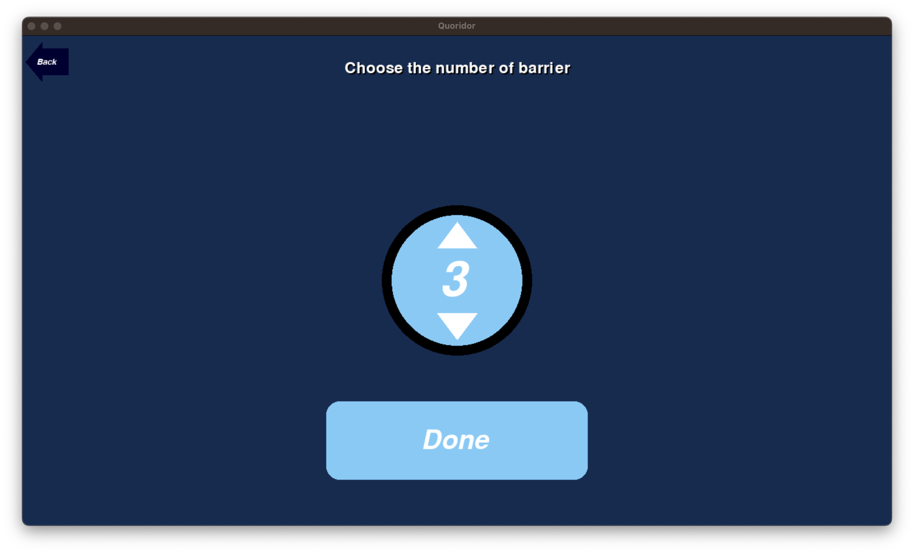
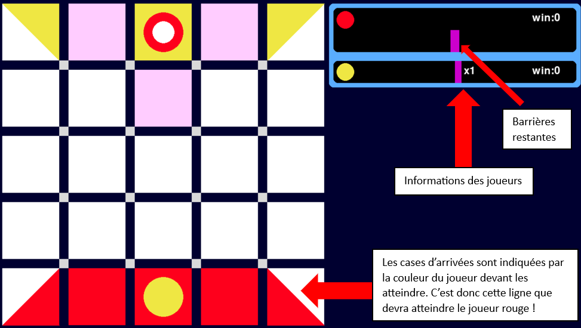
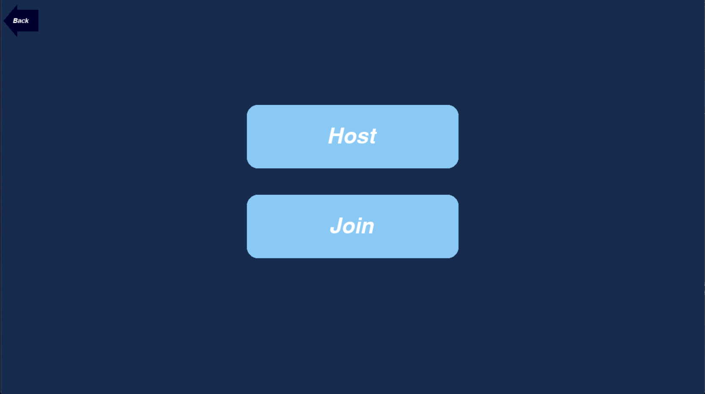

# Quoridor

###### réalisé par

- Baptiste Crepin
- Loïc Verdier
- Vivien Mauriaucourt

<section class=userDoc>

## Documentation utilisateur

---

### Installation et exécution

Pour exécuter le jeu Quoridor, suivez les étapes ci-dessous

1. Assurez-vous d'avoir **Python 3.11** installé sur votre système.
1. Installez les dépendances requises en **exécutant la commande** suivante dans votre **terminal**
   > **pip install socket pickle threading random time**
1. executez également cette commande afin d'installer une version de pygame fonctionnelle
   > **pip install pygame --pre**
1. Naviguez vers le répertoire contenant le code source téléchargé.
1. Exécutez le jeu en utilisant cette commande
   > **python -m main**
1. Le jeu **Quoridor** devrait se lancer avec une interface graphique.
1. Si ce n'est pas le cas essayez de lancer le jeu en utilisant un IDE tel que **Visual Studio Code** ou **Pycharm**

---

### Utilisation des menus

#### Menu principal

Au lancement du jeu, vous êtes accueillie par le menu principal, il vous offre 3 options

- "Play" pour lancer une partie
- "Rules" pour lire les règles du jeu
- "Quit" pour quitter le jeu

#### Bouton Retour

Un bouton retour est présent dans le coin haut gauche de chaque menu. Il permet de revenir au menu précédent.

#### Régles

La page de régles contient tout ce qu'il y à a savoir sur le déroulement de la partie. vous pouvez naviguer dans en utilisant le défilement de la molette de la souris.

#### Jouer une partie en solo

Deux options se présentent a vous

- "Solo" permet de jouer sur un ordinateur
- "Multi" permet de jouer en multijoueur sans fil-local

choisisez donc le mode solo

Indiquez maintenant le nombre de joueurs que vous souhaitez avoir dans votre partie.

Faites de même avec le nombre de bots

Indiquez maintenant la taille de la grille de jeu

Finalement choisisez le nombre de barières que vous souhaitez avoir par joueurs

les fleches correspondent a des boutons permettant d'augmenter ou de diminuer le nombre de barières

une fois que vous serez satisfaits de votre choix, cliquez sur le bouton "Done" afin de lancer la partie

La partie démarre, vous pouvez maintenant jouer !

- Le premier joueur est tiré **aléatoirement**.
- Le joueur qui doit jouer est désigné par une pastille blanche sur le plateau, son encard a droite est également plus grand que les autres.
- Les cases roses sont les cases où vous pouvez vous déplacer.

Félicitation ! Vous avez désormais toute les connaissances nécessaires pour démarer la partie !

#### Créer une partie multijoueur sans fil-local

Après avoir appuyé sur "Play"
Choisissez le bouton "Multi"

On souhaite créer un serveur, il faut donc appuyer sur le bouton "Host"

On choisi le nombre de joueurs (Humains).
A savoir que si vous choisissez 3 joueurs la partie sera comblée avec un bot. le jeu ne pouvant pas être joué par un nombre impaire de joueurs

Indiquez maintenant la taille de la grille de jeu

Choisisez le nombre de barières que vous souhaitez avoir par joueurs

Finalement nommez votre serveur pour que les autres joueurs puissent s'y connecter.

Vous n'avez plus qu'a attendre que vos amis vous rejoignent dans la salle d'attente.
Quand tout le monde est prêt, cliquez sur le bouton "Start" pour lancer la partie.

Félicitation ! Vous n'avez plus qu'a jouer !

#### Rejoindre une partie multijoueur sans fil-local

Après avoir appuyer sur le bouton Play
Choisissez le bouton "Multi".

On souhaite rejoindre un serveur, il faut donc appuyer sur le bouton "Join"

Après quelques secondes, un nouveau menu apparait, il peut y avoir deux cas:

Aucun serveur n'est trouvé. Vous pouvez appuyer sur le bouton "Refresh" pour actualiser la liste des serveurs.

un serveur est trouvé, cliquez dessus pour le rejoindre.

Vous avez rejoint la salle d'attente, plus qu'a patienter que l'host lance la partie.

</section>

---

## Documentation Technique

### Rétrospective du code source

- Un code réalisé en python
- 2 modes de jeu différents.
  - Local
  - Multijoueur sans fil-local
- Lisible, aéré, compréhensible et commenté pour les fonctions importantes.

#### Langage utilisé

Le jeu Quoridor a été développé en utilisant le langage de programmation Python. Python a été choisi en raison de ses nombreux avantages, notamment sa portabilité, sa simplicité d'utilisation et sa vaste collection de bibliothèques disponibles. Ces caractéristiques ont facilité le développement et l'extension du jeu avec des fonctionnalités supplémentaires.

#### Dépendances

Le jeu Quoridor utilise plusieurs bibliothèques Python pour faciliter son implémentation. Les principales dépendances sont les suivantes :

##### 1. Pygame

- Pygame est une bibliothèque de développement de jeux en Python qui facilite la création d'interfaces graphiques interactives.
  - Dans le contexte du jeu Quoridor, Pygame est utilisé pour gérer les éléments visuels tels que les graphismes, les menus, l'affichage des joueurs et des murs, ainsi que la gestion des événements du clavier et de la souris.

##### 2. Socket

- La bibliothèque Socket en Python permet la communication réseau entre différents ordinateurs.
  - Dans le contexte du jeu Quoridor, la bibliothèque Socket peut être utilisée pour mettre en place une communication entre les joueurs, permettant ainsi de jouer en sans fil local (LAN) contre d'autres joueurs.

##### 3. Pickle

- Pickle est une bibliothèque Python qui permet la sérialisation et la désérialisation d'objets Python.
  - Dans le contexte du jeu Quoridor, Pickle est utilisé pour convertir les objets Python en binaire pouvant être transférée via le réseau, facilitant ainsi la communication entre les joueurs lors du jeu en ligne.

##### 4. Threading

- La bibliothèque Threading en Python permet la création de threads, c'est-à-dire des processus qui s'exécutent simultanément.
  - Dans le contexte du jeu Quoridor, la bibliothèque Threading est utilisée pour gérer les communications réseau dans des thread séparé, afin de ne pas bloquer l'interface utilisateur pendant les échanges de données.

##### 5. Random

- La bibliothèque Random en Python fournit des fonctionnalités pour la génération de nombres aléatoires.
  - Dans le contexte du jeu Quoridor, la bibliothèque Random est utilisée pour générer des mouvements aléatoires pour les bots ainsi que pour déterminer aléatoirement l'ordre des joueurs au début de la partie.

##### 6. Time

- La bibliothèque Time en Python fournit des fonctionnalités pour la gestion du temps.
  - Dans le contexte du jeu Quoridor, la bibliothèque Time est utilisée pour introduire des délais entre les mouvements de bots, elle est également utilisée pour introduire un délais lors de la réception d'un message en multijoueur.

##### 7. Typing

- la blibliothèque Typing en Python permet de spécifier le type des variables et des fonctions.

#### 4. Structure du code

Le code source du jeu Quoridor est organisé en plusieurs modules pour faciliter la maintenance et l'extension. Les modules principaux comprennent :

- Graphical → Partie graphique
  - menu → Les menus permettant de lancer le jeu
  - barriers → Les barrières qui seront affichées sur le plateau
  - widgets → éléments présents dans les menus pouvant être crées facilement
- gameLogic → Algorithmes de logique du jeu (jeu en console)
- multi → Connexion des joueurs en P2P
- main.py → exécutable reliant les different modules

Structure des importation entre fichiers (en retirant pygame, socket, etc..)

bleue → graphique

vert → logique

rose → multijoueur

#### Structure du plateau de jeu

Le plateau est représentée par un tableau a double entrées de classes "Cell"

Representation de la classe "Cell":

- Coorinates: (x,y) : permet de connaitre la position de la case dans la grille
- Player : indique le joueur positionné sur la case
- Visited: sert a ne pas vérifier deux fois une case quand on utilise le pathfinding
- Walls :
- dictionnaire
- Clés : bas, droite
- Valeurs : booléens. False → le mur n'est pas posé | True → le mur est posé

"Walls" ne garde en mémoire que les murs bas et droite. Les murs haut et gauche sont respectivement les mur bas du voisin d'en haut et le mur droit du voisin de gauche. Voici un exemple sur une grille en 2x2.

On ne souhaite pas poser de murs en dehors de la grille. On ignorera donc les murs créant le périmètre du carré. Les index pris en compte vont donc de 0 → longueur - 1.

Une grille 2x2 ressemblerait donc plutôt a ceci:

#### Deux modes de jeu: Local et sans-fil local

Les deux modes de jeu sont organisés en sous classes

- Game → Classe parent comprenant toute la logique de jeu en console
  - localGame → enfant de Game comprend l'integration du graphique
    - MultiplayerClient → enfant de LocalGame réécrivant certaines méthodes pour implémenter les fonctionnalités du mode multijoueur.

Appliquer cette organisation en classes enfant et parents permet de garder les méthodes élémentaires tout en en ajoutant ou en écrivant de nouvelles fonctions par dessus ce qui nous permet de respecter le principe du DRY (don't repeat yourself)

#### Pathfinding

Dans Quoridor il est interdit d’empêcher un joueur de rejoindre son arrivée

le pathfinding a pour but d’empêcher le cas si dessus de se produire.

On commence par prendre les coordonnées des cases ou sont posés les joueurs,

Pour chaque joueur on prend les coordonnées de la case sur laquelle il est posé. Nous appelons récursivement une méthode pour chaque case qui nous renvoie les voisins disponibles (cases sans joueur et sans murs bloquant le déplacement). Si on détecte la case d'arrivé du joueur alors le joueur n'est pas bloqué. Si on arrive a la fin de l'appel récursif et qu'aucune case d'arrivée n'as été trouvée alors le joueur est considéré comme bloqué et le pathfinding empêchera de poser la barrière.

On a ensuite une méthode "possibleBarrierPlacement" qui utilise le pathfinding sus mentionné afin de créer une liste de barrières valides sur la grille. Cette liste est ensuite utilisé dans la partie graphique afin de pouvoir "hover" les barrières plaçable en rouge.

#### Logique de déplacement

Les joueurs peuvent se déplacer sur les cases orthogonalement adjacentes a celle ou ils sont positionnés. Si le joueur n'est pas bloqués par un mur ou un joueur adverse le mouvement est possible.

Si un élément viens à bloquer le déplacement, alors on regarde s'il s’agit d'un joueur ou d'une barrière. Pour le cas d'un joueur on regarde si on peut effectuer un saut par dessus. Si on est bloqué par une barrière ou qu'on ne peut pas sauter au dessus d'un joueur adverse, alors on envisage les déplacements diagonales.

#### Hover

Afin de pouvoir afficher plus clairement les mouvements possibles pour le joueur nous avons implémenté la logique de "hover". Si un déplacement est possible il est affiché en rose, si une

barrière est plaçable, elle est affichée en bleue quand on passe la souris dessus.

Pour d'arriver a ce résultat, on crée deux listes, une destinée aux déplacements et une aux barrières.

La liste de barrières test chaque case et direction possibles sur la grille (en excluant les cases les plus a droite et en bas, les barrières étant longue de 2 cases, impossible de les placer sur une fin de ligne ou de colonne). si le placement est valide, alors elle est ajoutée a la liste.

La liste de déplacements utilise un procédé est similaire a l'exception près qu'elle ne s’intéresse plus a toute les cellules mais uniquement aux cellules orthogonalement voisine a celles du pion. On suit ensuite la logique de déplacement pour déterminer quelles sont les déplacements valides puis on les ajoutes a la liste.

Au moment de l'affichage, on regarde si l'élément est dans la liste des actions possibles, si c'est le cas on change ses propriétés afin d'ajouter la logique de hover et de changer sa couleur.

#### Bots

Un bot est une classe enfant de la classe "Player". Il possédé donc les mêmes attributs qu'un joueur. Pour jouer rien de plus simple. Tout est aléatoire. En premier lieu on le bot choisi aléatoirement si il souhaite se déplacer ou poser une barrière. S'il ne possède plus de barrière, alors on le force a choisir l'opération déplacement. Le bot utilise ensuite la même liste de déplacement et placements possibles que le "hover" afin de choisir la coup a jouer.

### multijoueur
#### joueur
Dans le mode multijoueur, un client possède les caractéristiques suivantes :

- **Communication de Données et Synchronisation :** 
  Les fonctions responsables de la communication de données et de la synchronisation sont exécutées dans un thread séparé. Cette structure permet une meilleure adaptabilité aux actions des autres joueurs, qui peuvent survenir à tout moment.

- **Stabilité de l'Intégration avec Pygame :** 
  Exécuter ces fonctions dans un thread distinct assure une intégration stable avec Pygame, en particulier lors de l'utilisation d'instructions bloquantes.

#### Description des Fonctionnalités du Joueur :

La fonctionnalité multijoueur est principalement divisée en deux parties: le programme principal (classe `MultiplayerGame`) et le thread client (`StoppableThreadClient`).

1. **Programme Principal - MultiplayerGame :**

   - Après qu'un joueur effectue une action, le programme principal envoie un message via le thread client. Ce message contient l'état actuel du plateau de jeu, le numéro du joueur qui a effectué l'action, et le nombre de barrières restantes pour ce joueur. Ensuite, les fonctions de jeu sont temporairement en pause jusqu'à ce qu'une réponse du serveur soit reçue.
  
   - L'affichage et les fonctions de jeu ne sont actifs pour le pion du joueur que pendant son tour.

2. **Thread Client - StoppableThreadClient :**

   - Ce thread est responsable de communiquer avec le serveur et de mettre à jour les données de jeu en conséquence. Voici comment il fonctionne principalement:

     - Pendant le jeu, la procédure d'écoute du serveur est toujours active. Elle exécute différentes fonctions en fonction de l'en-tête du message reçu.
    
       - Si le message contient l'état du jeu, une fonction est appelée pour mettre à jour l'état du jeu dans le programme principal.
    
       - Si le message contient l'instruction de fin de partie, l'état du plateau de jeu est mis à jour, et la procédure de fin de partie est appelée.

En séparant les tâches de communication et de synchronisation de la boucle de jeu principale, le programme peut gérer efficacement les interactions multijoueurs en temps réel tout en maintenant la stabilité. 

##### Hôte
En plus du programme et du thread client, le joueur qui sert d'hôte exécute également un thread distinct pour chaque joueur qui se connecte à la partie. Ces threads sont essentiels pour assurer la synchronisation de certaines données entre les joueurs, notamment en ce qui concerne la gestion de l'ordre des tours. Pour faciliter cette synchronisation, la classe utilise un objet `queue` qui permet de suivre et de gérer efficacement l'ordre dans lequel les joueurs jouent.

pour chaque instance su server la procedure principale est la suivante: 

###### Fonction principale de la Classe `serverSubThread`:

La fonction `run` est centrale au fonctionnement du thread serveur hébergé par le joueur. Elle gère la communication entre les joueurs connectés. Voici comment cette fonction fonctionne principalement:

   - **Réception des Messages:** La méthode `run` écoute en continu les messages provenant du client connecté à ce thread. Elle décode les messages reçus qui sont sérialisés avec `pickle`.

   - **Gestion des Messages:** Une fois un message reçu, la méthode détermine le type de message à l'aide de son en-tête et appelle la fonction de gestion appropriée. Les types de messages et leurs gestionnaires sont définis dans un dictionnaire `message_handlers`.

   - **Traitement Spécifique des Messages:** Selon le type de message reçu (`game_state`, `chat`, `game_end`, `resetGame`), différentes fonctions sont appelées pour effectuer des actions spécifiques, telles que la mise à jour de l'état du jeu ou la gestion des messages de chat.

   - **Gestion des Erreurs:** Si une erreur se produit lors de la réception ou du traitement d'un message (par exemple, en cas de déconnexion d'un client), un message de déconnexion est envoyé à tous les clients connectés, et une exception est levée.

En utilisant un thread dédié pour chaque client connecté, l'hôte peut gérer efficacement la communication et la synchronisation de l'état du jeu entre tous les joueurs de manière concurrente, ce qui permet de maintenir des performances élevées et une expérience de jeu fluide.