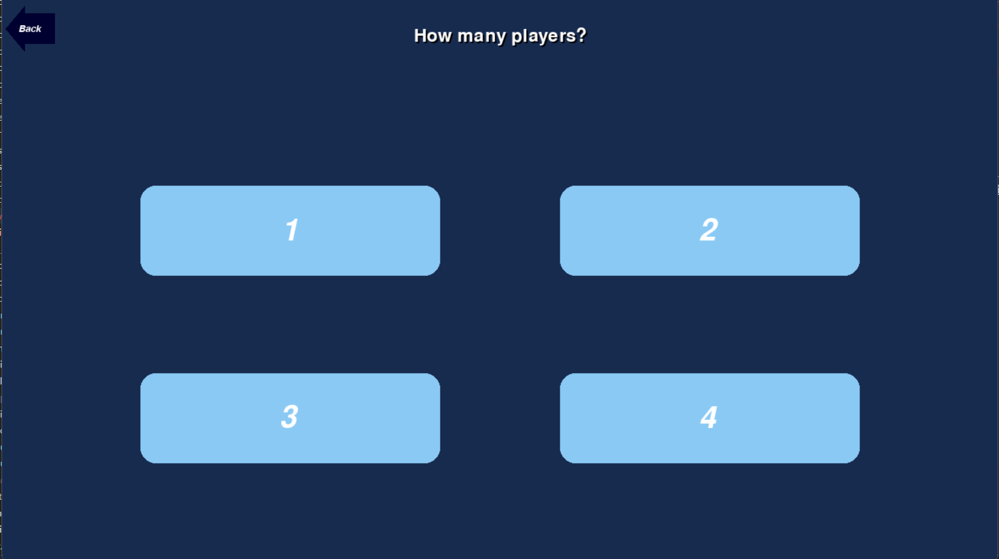
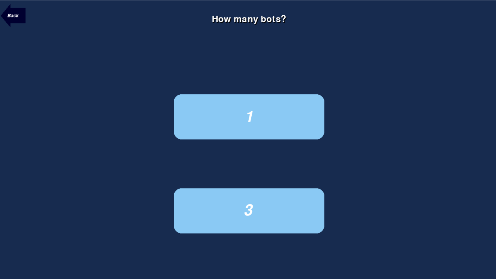
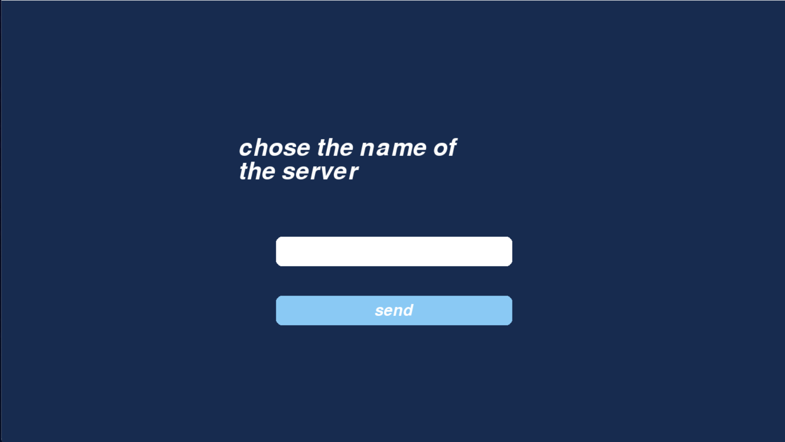

# Quoridor

# Documentation Utilisateur

## Installation et exécution

Pour exécuter le jeu Quoridor, suivez les étapes ci-dessous :

1. Assurez-vous d'avoir Python 3.11 installé sur votre système.
1. Installez les dépendances requises en exécutant la commande suivante dans votre terminal :
   > "pip install socket pickle threading random time"
1. executez également cette commande afin d'installer une version de pygame fonctionnelle :
   > "pip install pygame --pre"
1. Naviguez vers le répertoire contenant le code source téléchargé.
1. Exécutez le jeu en utilisant la commande suivante :
   > "python -m main"
1. Le jeu Quoridor devrait se lancer avec une interface graphique.
1. Si ce n'est pas le cas essayez de lancer le jeu en utilisant un IDE tel que Visual Studio Code ou Pycharm

En lançant le jeu on arrive sur la page suivante :

#

Avant de jouer on regarde les règles du jeu afin de pas être perdue.
On clique sur le bouton « Rules ».

En bas de la page nous avons des images qui montres tous les mouvements possibles
En haut de la page nous avons une brève description des règles

Nous pouvons ensuite quitter le menu grâce au bouton back et lancer notre première partie.
Nous sommes de retour sur notre menu principal.

# Jouer une partie en solo :

Après avoir appuyer sur le bouton Play

Choisissez le bouton "Solo".

Puis le nombre de joueur.

Ensuite le nombre de bots.

Puis la taille du plateau de jeu.

Enfin le nombre de barières(limités selon la taille du plateau).

Félicitation ! Vous êtes désormais en partie !

# Jouer une partie en multi en créant son server :

Après avoir appuyer sur le bouton Play

Choisissez le bouton "Multi".

On clique sur le bouton "Host"

Puis le nombre de joueur.

Puis la taille du plateau de jeu.

Enfin le nombre de barières(limités selon la taille du plateau).

Nommez le server.

puis on attend que les joueurs rejoignent.

Félicitation ! Vous êtes désormais en partie !

# Jouer une partie en multi en rejoignant un server :

Après avoir appuyer sur le bouton Play

Choisissez le bouton "Multi".

On clique sur le bouton "Host"

Ensuite on arrive dans salle où l’on voit tous les servers disponible (ici aucun server n’est disponible on va donc appuyer sur le bouton « Refresh »).

On a trouvé un server ! Cliquez dessus pour le rejoindre !

Félicitation ! Vous êtes désormais en partie !
